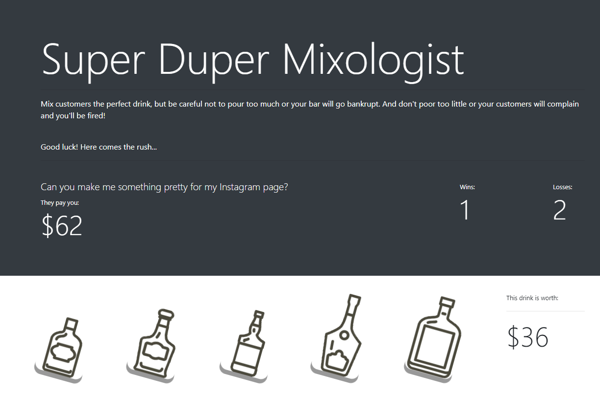

# Super Duper Mixologist 
Super Duper Mixologist is a game made utilizing primarily Javascript and the jQuery library. 

This is a basic clicker game where the player must match the randomly generated target number to win. If the player's number goes over the target number or "busts", the player loses the round.

This project required the creation and utilization of multiple functions, variables and event listeners within the Javascript in order to track, randomize, and print different values as the game progresses. jQuery was used specifically in order to make the process of coding the Javascript more efficient and ultimately, more organized.

### How to Play
* Click on the bottles at the bottom half of the screen to increase the value of the drink you're pouring for your customer.
    * Be careful though! The bottles will change value after every round.
    * _Hint: The leftmost bottle is always worth 1 point._

___
## Technologies Used
* HTML
* CSS
* [@Bootstrap](https://getbootstrap.com/) CSS library
* Javascript
* [@jQuery](https://jquery.com/) Javascript library
___
### Audio/Visual Resource Credits
* Chrono Trigger OST 30 - Reckless Robo Gang Johnny
    * Music by Yasunori Mistuda, Nobuo Uematsu & Noriko Matsueda

* Other sound effects: [SoundBible.com](https://soundbible.com)

* Bottle vector art: [@microstocksec](https://www.vectorstock.com/royalty-free-vectors/vectors-by_microstocksec)
